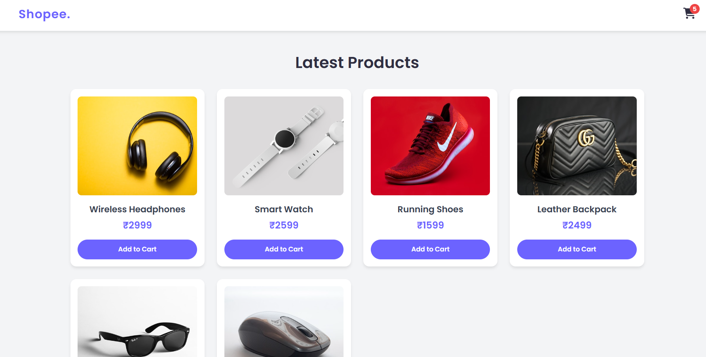
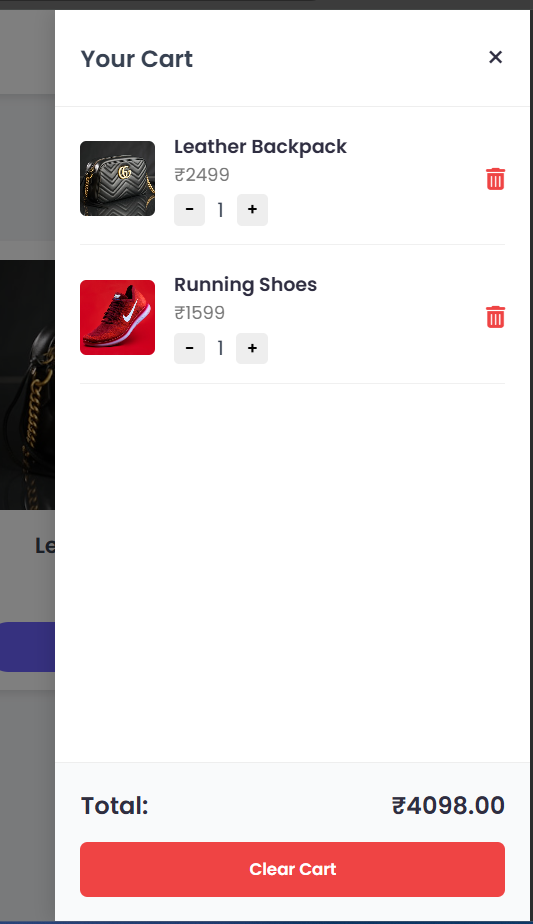
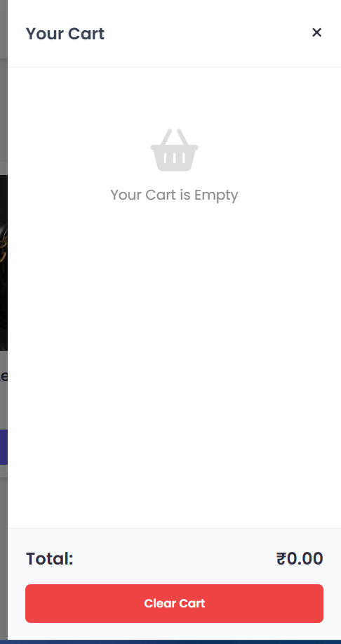

# 🛒 Add to Cart App (Vanilla JavaScript)

A fully functional **Add to Cart application** built using **HTML, CSS, and Vanilla JavaScript**.  
This project demonstrates real-world shopping cart functionality with clean UI and persistent data using `localStorage`.

---

## 📸 Screenshots

### 🛍 Product Listing


### 🧾 Cart Sidebar (With Items)


### 🧺 Empty Cart State


---

## ✨ Features

- Dynamic product listing using JavaScript
- Add products to cart
- Increase / decrease product quantity
- Remove items from cart
- Clear entire cart
- Cart item count badge
- Total price calculation
- Persistent cart data using **localStorage**
- Responsive cart sidebar UI
- Empty cart state handling

---

## 🛠 Tech Stack

- HTML5
- CSS3 (Flexbox & Grid)
- JavaScript (ES6)
- Font Awesome Icons
- Browser LocalStorage

---

## ⚙️ How It Works (Logic Overview)

- Products are rendered dynamically from a JavaScript array
- Cart data is stored as an array of objects
- Duplicate products increase quantity instead of adding again
- `Array.map()`, `find()`, and `reduce()` are used for logic
- Cart data is saved in `localStorage` to persist on refresh

---

## 🚀 How to Run Locally

1. Clone the repository  
   ```bash
   git clone https://github.com/PrernaSingh-90/Add-To-Cart-App.git
  
2. Open the Project folder
3. Open index.html in your browser

📚 Learning Outcomes

- DOM manipulation
- Event handling
- Cart state management
- JavaScript array methods
- LocalStorage usage
- UI state handling (empty / filled cart)

  👩‍💻 Author
Prerna
Frontend Developer (HTML, CSS, JavaScript, React)
